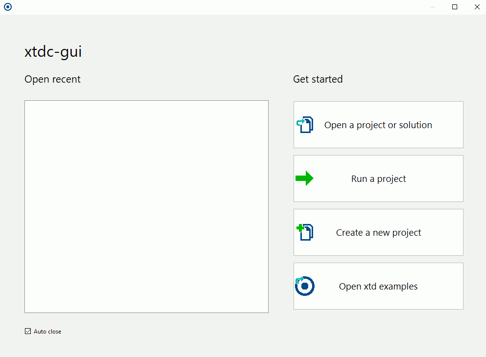

| [Home](home.md) | [Gallery](gallery.md) | [Examples](examples.md) | [Downloads](downloads.md) | [Documentation](documentation.md) | [Sources](https://github.com/gammasoft71/xtd) | [Project](https://sourceforge.net/projects/xtdpro/) | [Gammasoft](gammasoft.md)  | [Contact](contact.md) | [Website](https://gammasoft71.wixsite.com/gammasoft) |

# Download the latest stable xtd version

You can download latest stable version on [SourceForge](https://sourceforge.net/projects/xtdpro/)

[](https://sourceforge.net/projects/xtdpro/files/latest/download)

# Clone the latest xtd commit

Or clone latest development version on [GitHub](https://github.com/gammasoft71/xtd).

```shell
git clone https://github.com/gammasoft71/xtd.git
```

# Libraries dependency

xtd is currently in development mode and the only [xtd.form.native.wxwidgets](https://github.com/gammasoft71/xtd_forms/tree/master/src/xtd_forms_native_wxwidgets/README.md) backend is supported.

See [wxWidgets downloads](https://www.wxwidgets.org/downloads/) to install [wxWidgets](https://www.wxwidgets.org/)  on your system.

In the future xtd.forms will use [xtd.form.native.win32](https://github.com/gammasoft71/xtd_forms/tree/master/src/xtd_forms_native_win32/README.md) on Windows, [xtd.form.native.cocoa](https://github.com/gammasoft71/xtd_forms/tree/master/src/xtd_forms_native_cocoa/README.md) on macOS and [xtd.form.native.gtk4](https://github.com/gammasoft71/xtd_forms/tree/master/src/xtd_forms_native_gtk4/README.md) on linux. Other backend like [xtd.form.native.qt5](https://github.com/gammasoft71/xtd_forms/tree/master/src/xtd_forms_native_qt5/README.md) will be ported too.

# Installation

## Windows 7 SP1 or later

1. Install Microsoft Visual Studio 2017 Community
  
   In order to build xtd.forms, you first need download and install Microsoft Visual Studio 2017 community from [https://www.visualstudio.com](https://www.visualstudio.com).

2. Install CMake 3.3 or later
  
   After Microsoft Visual Studio, you need to install the latest version cmake from [https://cmake.org/download/](https://cmake.org/download/)
   
   *Remarks: Verify if you can execute 'cmake --version' in "Command Prompt", if it's no, add cmake install directory to your path.*

3. After installing Microsoft Visual Studio and CMake, do the following in "Command Prompt" to build and install xtd.forms :

```shell
cd xtd_path_name
install
```

4. Create as many unit tests as you want with xtd.forms.


## macOS 10.14 (OS X Mojave) or later

1. Install Xcode 10 or later
  
   In order to build xtd.forms, you first need download and install Xcode from App Store and install "Commands line tools".

   *Remarks: Verify if you can execute 'clang --version' in "Terminal".*

2. Install Homebrew
  
   After Xcode, to build Switch, you need to install package manager Homebrew ([http://brew.sh](http://brew.sh)).
   
```shell
/usr/bin/ruby -e "$(curl -fsSL ttps://raw.githubusercontent.com/Homebrew/install/master/install)"
```

3. After installing Xcode and Homebrew, do the following in "Terminal" to Build and install :

```shell
cd xtd_path_name
./install
```

4. Create as many unit tests as you want with xtd.forms.

## CentOS 7, Debian 9.7, Elementary OS 5.0, Fedora 29, LinuxMint 19.1, RedHat 7.5 and Ubuntu 18.04 (or later)

1. Do the following in "Terminal" to Build and install :

```shell
cd xtd_path_name
./install
```

2. Create as many unit tests as you want with xtd.forms.


## Other linux Distribution

1. Install g++ 7 or later
  
   In order to build , you first need download and install g++ 7 or later.

   *Remarks: Verify if you can execute 'g++ --version' in "Terminal".*

2. Install CMake 3.3 or later
  
   After Microsoft Visual Studio, you need to install the latest version cmake from [https://cmake.org/download/](https://cmake.org/download/)

   *Remarks: Verify if you can execute 'cmake --version' in "Terminal", if it's no, add cmake install directory to your path.*

3. After installing g++ and CMake, do the following in "Terminal" to Build and install :

```shell
cd xtd_path_name
./install
```

4. Create as many applications as you want with xtd.

# Build and run your first xtd application

Use internal tools installed with xtdc-gui.

## xtdc-gui (gui)

Let the gui tools drive you for create your new project.

* First step choose "Create a new project" button.
* Choose your project template then click to "Next" button
* Choose the name for your new project and the path where the project will be create, and finaly click "Create button" to create it.



## xtdc (console)

Create your new project with a simple command line tools.

For example, you can type :

```bash
xtdc new gui hello_world
cd hello_world
xtdc open
```
"xtdc" command line tool will creating hello_world gui application, generate Visual Studio sultion if you running it on Windows, Xcode project if you are on macOS or Code::Blocks project if you are on Linux. If you are on Windows, Visual Studio will running with your new project. If you are on macOS, Xcode will running with your new project. If you are on Linux, Code::Blocks will running with your project.

## Remarks

For more information type

```bash
xtdc --help
```

______________________________________________________________________________________________

© 2020 Gammasoft.
