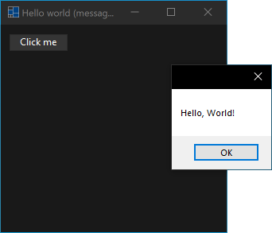

| [Home](home.md) | [Gallery](gallery.md) | [Examples](examples.md) | [Downloads](downloads.md) | [Documentation](documentation.md) | [Sources](https://github.com/gammasoft71/xtd) | [Project](https://sourceforge.net/projects/xtdpro/) | [Gammasoft](gammasoft.md)  | [Contact](contact.md) | [Website](https://gammasoft71.wixsite.com/xtdpro) |

# Examples

The classic first applications 'Hello World'.

## Console

### hello_world_console.cpp:

```c++
#include <xtd/xtd>

using namespace xtd;

int main() {
  console::background_color(console_color::blue);
  console::foreground_color(console_color::white);
  console::write_line("Hello, World!");
}
```

### CMakeLists.txt:

```cmake
cmake_minimum_required(VERSION 3.3)

project(hello_world_console)
find_package(xtd REQUIRED)
add_sources(hello_world_console.cpp)
target_type(CONSOLE_APPLICATION)
```

### Build and run

Open "Command Prompt" or "Terminal". Navigate to the folder that contains the project and type the following:

```shell
xtdc run
```

### Output

```
Hello, World!
```

## Gui

### hello_world_form.cpp

```c++
#include <xtd/xtd.xtd>

using namespace xtd::forms;

int main() {
  button button1;
  button1.text("Click me");
  button1.location({10, 10});
  button1.click += [] {
    message_box::show("Hello, World!");
  };

  form form1;
  form1.text("Hello world Form");
  form1.controls().push_back(button1);

  application::run(form1);
}

```

### CMakeLists.txt:

```cmake
cmake_minimum_required(VERSION 3.3)

project(hello_world_form)
find_package(xtd REQUIRED)
add_sources(hello_world_form.cpp)
target_type(GUI_APPLICATION)
```

### Build and run

Open "Command Prompt" or "Terminal". Navigate to the folder that contains the project and type the following:

```shell
xtdc run
```

### Output

#### Windows :




#### macOS :


#### Linux Gnome :


## Unit tests

### hello_world_test.cpp:

```c++
#include <xtd/xtd>
#include <string>

using namespace std;
using namespace xtd::tunit;

namespace unit_tests {
  class test_class_(hello_world_test) {
  public:
    void test_method_(create_string_from_literal) {
      string s = "Hello, World!";
      valid::are_equal(13, s.size());
      assert::are_equal("Hello, World!", s);
    }
    
    void test_method_(create_string_from_chars) {
      string s = {'H', 'e', 'l', 'l', 'o', ',', ' ', 'W', 'o', 'r', 'l', 'd', '!'};
      valid::are_equal(13, s.size());
      string_assert::starts_with("Hello,", s);
      string_assert::ends_with(" World!", s);
    }
  };
}

int main() {
  return console_unit_test().run();
}
```

### CMakeLists.txt:

```cmake
cmake_minimum_required(VERSION 3.3)

project(hello_world_test)
find_package(xtd REQUIRED)
add_sources(hello_world_test.cpp)
target_type(TEST_APPLICATION)
```

### Build and run

Open "Command Prompt" or "Terminal". Navigate to the folder that contains the project and type the following:

```shell
xtdc run
```

### Output

```
Start 2 tests from 1 test case
Run tests:
  SUCCEED hello_world_test.create_string_from_literal (0 ms total)
  SUCCEED hello_world_test.create_string_from_chars (0 ms total)

Test results:
  SUCCEED 2 tests.
End 2 tests from 1 test case ran. (0 ms total)
```

[Click here to see more examples](../examples/README.md)

______________________________________________________________________________________________

© 2021 Gammasoft.
