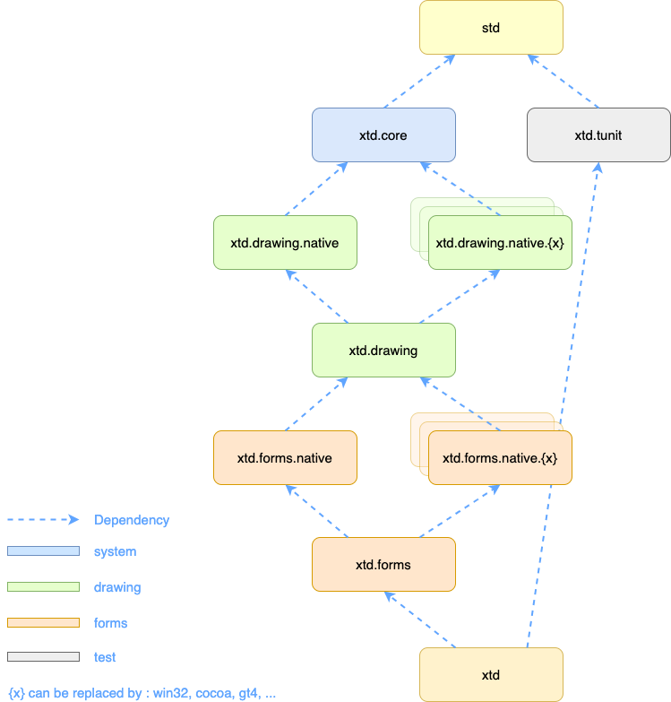

| [Home](home.md) | [Downloads](downloads.md) | [Examples](examples.md) | [Documentation](documentation.md) | [Sources](https://github.com/gammasoft71/xtd) | [Project](https://sourceforge.net/projects/xtdpro/) | [Contact](contact.md) | [Gammasoft](https://gammasoft71.wixsite.com/gammasoft) |

# The xtd libraries hierarchy

# xtd is composed of several libraries

These libreries are grouped by theme :

- **system** : The *xtd.core* library is modern C++17 libraries of classes, interfaces, and value types that provide access to system functionality. It is the foundation on which c++ applications, components, and controls are built.
- **drawing** : The *xtd.drawing* library contains types that support basic GDI+ graphics functionality. Child namespaces support advanced two-dimensional and vector graphics functionality, advanced imaging functionality, and print-related and typographical services. A child namespace also contains types that extend design-time user-interface logic and drawing.
- **forms** : The *xtd.forms* library contains classes for creating Windows-based applications that take full advantage of the rich user interface features available in the Microsoft Windows, Apple macOS and linux base operating system.
- **tunit** : The *xtd.tunit* library is a unit-testing framework for modern C++17. Initially ported from [Microsoft.VisualStudio.TestTools.Cpp](https://docs.microsoft.com/en-us/visualstudio/test/microsoft-visualstudio-testtools-cppunittestframework-api-reference).

See [xtd libraries architecture](architecture.md).

______________________________________________________________________________________________

© 2020 Gammasoft.
