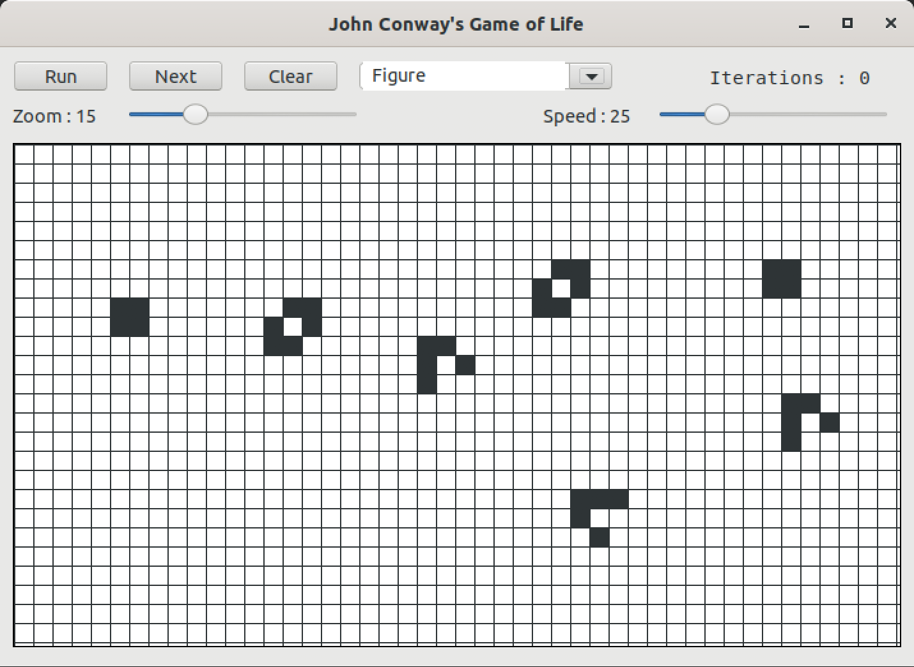
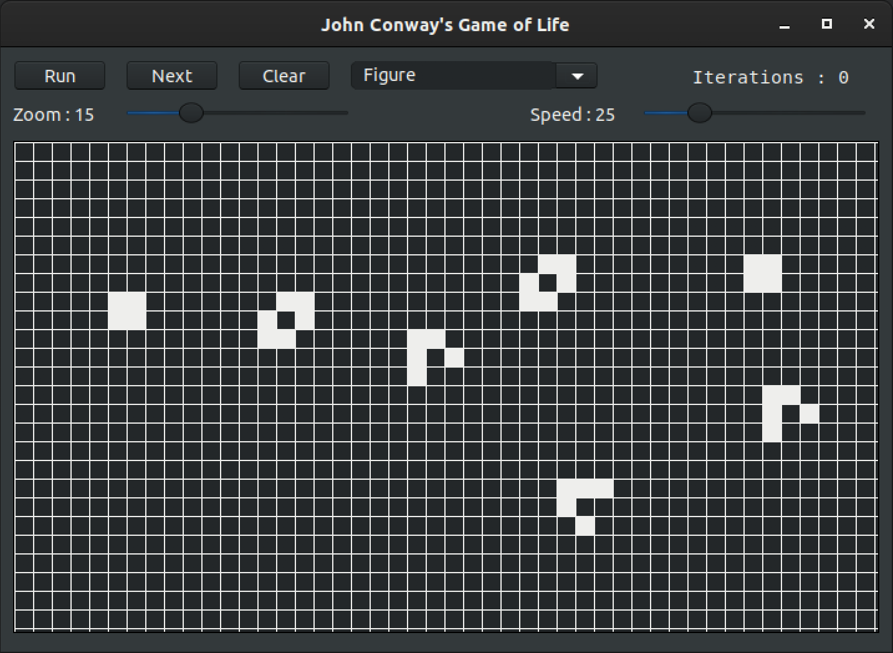

# game_of_life

The Game of Life is not your typical computer game. It is a 'cellular automaton', and was invented by Cambridge mathematician John Conway.

This game became widely known when it was mentioned in an article published by Scientific American in 1970. 
It consists of a collection of cells which, based on a few mathematical rules, can live, die or multiply. 
Depending on the initial conditions, the cells form various patterns throughout the course of the game.

# The Rules

## For a space that is 'populated':

* Each cell with one or no neighbors dies, as if by solitude.
* Each cell with four or more neighbors dies, as if by overpopulation.
* Each cell with two or three neighbors survives.

## For a space that is 'empty' or 'unpopulated'

* Each cell with three neighbors becomes populated.

# The Controls

Choose a figure from the pull-down menu or make one yourself by clicking on the cells with a mouse. 
A new generation of cells (corresponding to one iteration of the rules) is initiated by the 'Next' button. 
The 'Run' button advances the game by several generations. 
Game speed is regulated by the speed track bar and the size of the cells with the size track bar.

# Sources

[src/cell.h](src/cell.h)

[src/cell_event_args.h](src/cell_event_args.h)

[src/cell_event_handler.h](src/cell_event_handler.h)

[src/grid.h](src/grid.h)

[src/game_of_life.cpp](src/game_of_life.cpp)

[CMakeLists.txt](CMakeLists.txt)

# Build and run

Open "Command Prompt" or "Terminal". Navigate to the folder that contains the project and type the following:

```shell
xtdc run
```

# Output

## Windows :


## macOS :


## Gnome :




